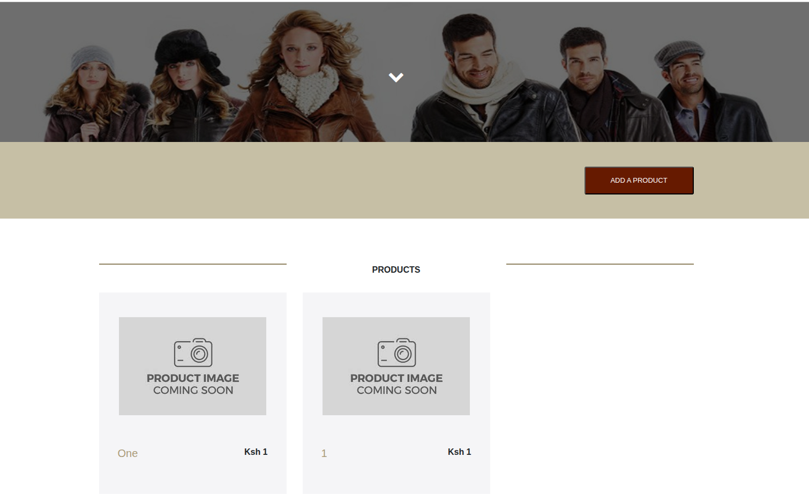
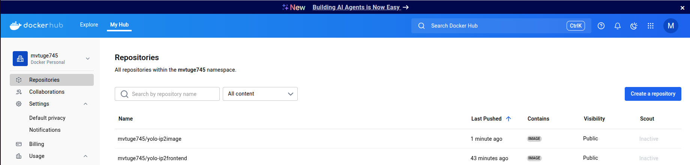
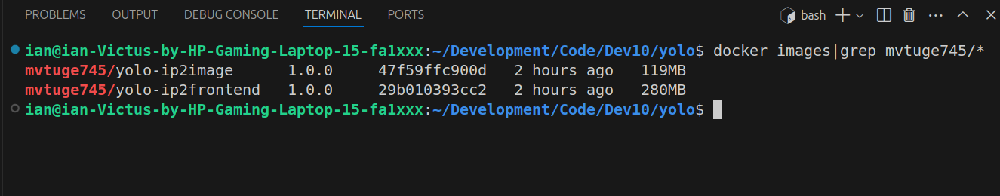

## IP 2 Creating a basic microservice
# Setup 
1. Fork and clone [this repo](https://github.com/Vinge1718/yolo) which is a functional e-commerce website
   - Clone with HTTPS
   ```bash
   git clone https://github.com/Vinge1718/yolo.git
   ```
   - Clone with SSH
   ```bash
   git clone git@github.com:Vinge1718/yolo.git
   ```     
2. Run the website on the browser to test the "Add Product" product functionality
   -Navigate to the client folder:
   ```bash
   cd client
   ```
   -Install dependencies
   ```bash
   npm install
   ```
   -Provision the app
    ```bash
   vagrant up --provision
   ``` 
   -Launch the app
   ```bash
   npm start
   ```
   -Open a new terminal and navigate to the backend 
   ```bash
   cd backend
   ```
   -Start the backend
   ```bash
   npm start
   ```
3. The website should be up and running with the "Add product" functionality working

  

# Creating the Dockerfiles to run the necessary containers
# Frontend Dockerfile (client)
1. Open the terminal and navigate to the client folder to create the Dockerfile
   ```bash
   cd client
   ```
   ```bash
   touch Dockerfile
   ```
2. Access the Dockerfile using an editor to make changes to the Dockerfile
3. Designing the Dockerfile followed to containerise the frontend used the following logic:
   - Getting a small base image,node(alpine),from which the container is built
   - Defining the working directory and copying the relevant frontend code to it
   - Install dependencies
   - Exposing the container through a port
   - Executing the relevant command to run the frontend  i.e. npm start

# Backend Dockerfile
1. Open the terminal and navigate to the backend folder to create the Dockerfile
   ```bash
   cd backend
   ```
   ```bash
   touch Dockerfile
   ```
2. Access the Dockerfile using an editor to make changes to the Dockerfile
3. Designing the Dockerfile followed to containerise the backend followed a similar logic to the frontend

# Orchestration of containers using docker-compose
1. Access the terminal from the main directory and create the docker-compose file
   ```bash
   touch docker-compose.yaml
   ```
2. The docker-compose file is needed to orchestrate the containers and was designed using the following steps:
   - Creating a mongodb container to store data with volumes attached for data persistence
   - Running the frontend container through the Dockerfile defined in the client folder
   - Running the backend container through the Dockerfile defined in the backend folder
   - Creating a network to facilitate communication between the containers.
   - Creating the volumes to be used for data persistence
3. The docker-compose file can be run using the command below
   ```bash
   docker-compose up --build
   ```
4. To verify all the containers are running, use the command docker compose ps where the output should show that all 3 containers are running.
    ```bash
   docker-compose ps
   ```
5. Data persistence of the data volumes can also be verified by adding more products to the "Add products" section of the website
   
# Pushing the images to Dockerhub
1. Navigate to the frontend and push the image to dockerhub
   ```bash
   cd client
   ```
   ```bash
   docker build -t mvtuge745/yolo-ip2frontend:1.0.0 .
   ```
   ```bash
   docker push mvtuge745/yolo-ip2frontend:1.0.0
   ```
2. Navigate to the backend and the same
   ```bash
   cd backend
   ```
   ```bash
   docker build -t mvtuge745/yolo-ip2image:1.0.0 .
   ```
   ```bash
   docker push mvtuge745/yolo-ip2image:1.0.0
   ```
3. Login to Dockerhub to verify tha the images have been pushed

   
4. The final image sizes (combined 399MB)can be obtained using the grep command - adjust by replacing mvtuge745 with the name of the repo
    ```bash
   docker images|grep mvtuge745/*
   ```
   


   


   
   

