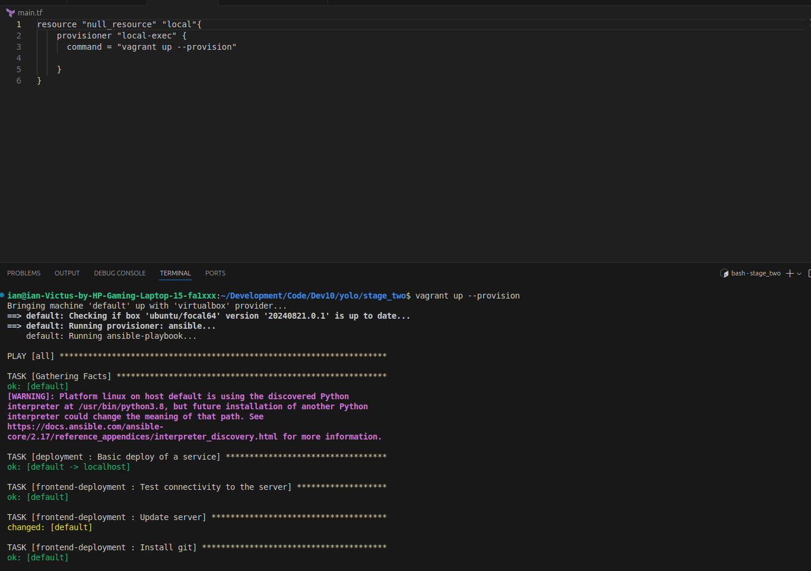

  ## Stage 2: Ansible and Terraform Instrumentation
1. In the same directory checkout into a branch named "Stage_two". Create a new directory in the stage-1-Ansible-root folder and name it after the branch you just checked into.
     ```bash
      git checkout -b Stage_two
   ```
     ```bash
      mkdir Stage_two
   ```
   
2. Create Terraform scripts to provision the application
  - Navigate to the terraform file and add the code to provision the application on the vagrant virtual machine then run:
   ```bash
      terraform init
      terraform plan
      terraform apply
   ```
    
   
3. Ansible YAML playbook should trigger both the resources provision using Terraform as well as the server configuration using Ansible roles playbooks.
  - Navigate to the root of the playbook and add a role that triggers the provisioning of the application using terraform as well running of the application
   ```bash
   ansible-galaxy init deployment
   ```  
   - After adding the configurations, trigger the deployment using vagrant up --provision
   ```bash
   vagrant up --provision
   ```
   
