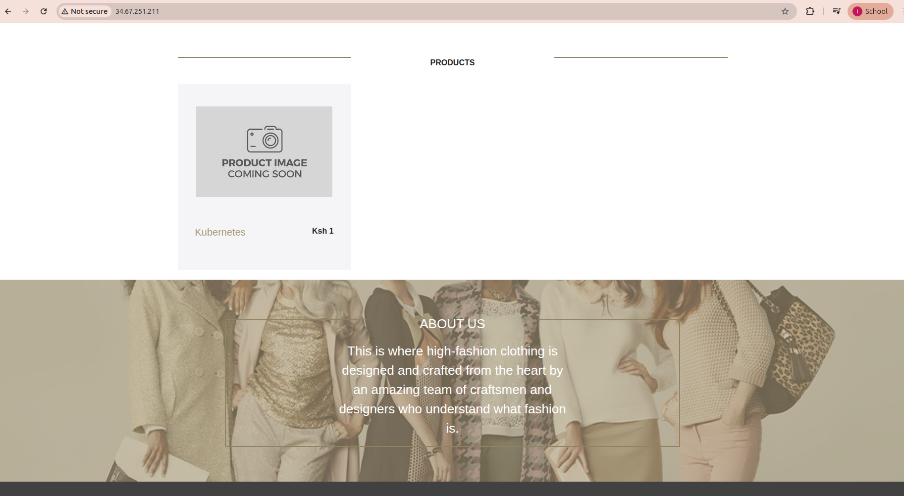

## IP 4 Orchestration with Kubernetes
 1. Create a kubernetes cluster on GKE.
 2. Setup Connection to created GKE cluster in with your local machine or cloud shell.
    ```bash
    gcloud container clusters get-credentials <CLUSTER_NAME> --zone <ZONE> --project <PROJECT_ID>
   ```
 3. Retag the Docker images for the frontend and backend

 4. Install Google CLI
    ```bash
    sudo apt-get update && sudo apt-get install google-cloud-cli
   ```
 5. Authenticate to GCR
    ```bash
      gcloud auth configure-docker us-central1-docker.pkg.dev
   ```
 6. Create a repo and push docker images to GCR(Google Container Registry)
    ```bash
      docker push REGION-docker.pkg.dev/PROJECT-ID/REPOSITORY/IMAGE:TAG
   ```
 7. Create a manifest folder with the necessary files. This project aimed at deploying mongoDB with statefulsets and creating persistent volumes dynamically with  persistent volume claims through a stateful class. Frontend and backend deployments were also created. Ingress object was also employed for routing traffic to the specific backend and frontend pods

 8. Apply the manifest files starting with the storage class and the persistent volume claim
   ```bash
      kubectl apply -f sc.yaml
   ```
   ```bash
      kubectl apply -f pvc.yaml
   ```
   ```bash
      kubectl apply -f stateful.yaml
   ```
   ```bash
      kubectl apply -f backend.yaml
   ```
   ```bash
      kubectl apply -f frontend.yaml
   ```
   ```bash
      kubectl apply -f ingress.yaml
   ```

 9. Run kubectl get ingress to get the port for your app
   ```bash
      kubectl get ingress
   ```
10. The app should be accessible on the link where the "Add Product" functionality stores products persistently
