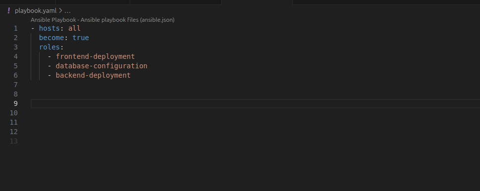
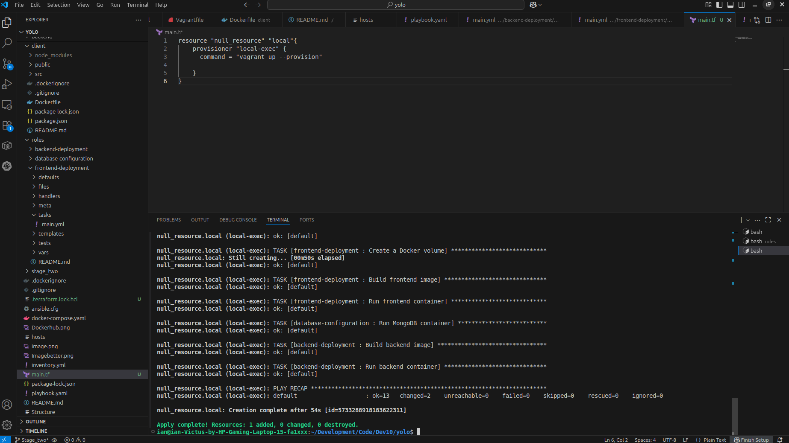

### IP 3 Configuration Management
## Stage 1: Ansible Instrumentation
# Prerequisites
 - Ansible [core 2.17.12]
 - Terraform v1.12.2
 - Vagrant 2.4.7
 # Steps
1. Setting up the environment by provisioning a vagrant virtual machine with the latest ubuntu server.
    - Initialise vagrant inside you inveronment by navigating to the project root folder and running the vagrant init command
   ```bash
   vagrant init
   ```
    - Add a vagrant box environment configured with the latest ubuntu image
   ```bash
   Vagrant box add ubuntu/focal64
   ```  
   - Confirm the vagrant box installation using the vagrant box list command   
   ```bash
   Vagrant box list
   ```  
2. Create the ansible files necessary to complete the task at the root level of the project
   ```bash
   touch ansible.cfg
   ```  
   ```bash
   touch hosts
   ```  
    ```bash
   mkdir roles
   ```  
    ```bash
   touch playbook.yml
   ```  
   ```bash
   touch inventory.yml
   ```  
3. Navigate to the Vagrant file and add the configurations necessary to run the ansible playbook on provisioning amd run using ubuntu/focal box
   ```bash
    config.vm.box = "ubuntu/focal64"
    config.vm.provision "ansible" do |ansible|
    ansible.playbook = "playbook.yaml"

    end
   ```  
4. Start,provision and access the virtual machine via SSH
   ```bash
   vagrant up --provision
   ```  
   ```bash
   vagrant ssh
   ```  


5. Configuring the playbook to run the project.
   - Navigate to the roles folder on the terminal to the add the roles to run the frontend, backend and the database using the galaxy init command
   ```bash
   ansible-galaxy init backend-deployment
   ```  
   ```bash
   ansible-galaxy init frontend-deployment
   ```  
   ```bash
   ansible-galaxy init database-configuration
   ```  
   - Configure each of the roles to run the frontend, database and backend respectively and call these roles from the main playbook for a more modular design
   
   
6. Run the command vagrant ssh-config to obtain the ansible user and path to the private key file which are added to the ansible.cfg file
    ```bash
   vagrant ssh-config
   ```
7. Start and provision the server to run the application
   ```bash
   vagrant up --provision
   ```
8. Navigate to the frontend on your browser and test the "Add product" funtionality. Test persistence of the data by halting and restarting the VM and   navigating to the browser
    ```bash
   vagrant halt
   ```
    ```bash
   vagrant up --provision
   ```
9. You should be able to see the added product on the browser

   
   ## Stage 2: Ansible and Terraform Instrumentation
1. In the same directory checkout into a branch named "Stage_two". Create a new directory in the stage-1-Ansible-root folder and name it after the branch you just checked into.
     ```bash
      git checkout -b Stage_two
   ```
    ```bash
      mkdir Stage_two
   ```
 2. Create Terraform scripts to provision the application
  - Navigate to the terraform file and add the code to provision the application on the vagrant virtual machine 
     ```bash
      terraform init
   ```
    ```bash
      terraform plan
   ```
    ```bash
      terraform apply
   ```
   
 3. Ansible YAML playbook should trigger both the resources provision using Terraform as well as the server configuration using Ansible roles playbooks.
  - Navigate to the root of the playbook and add a role that triggers the provisioning of the application using terraform as well running of the application
   ```bash
   ansible-galaxy init deployment
   ```  
   - After adding the configurations, trigger the deployment using vagrant up --provision
   ```bash
   vagrant up --provision
   ```